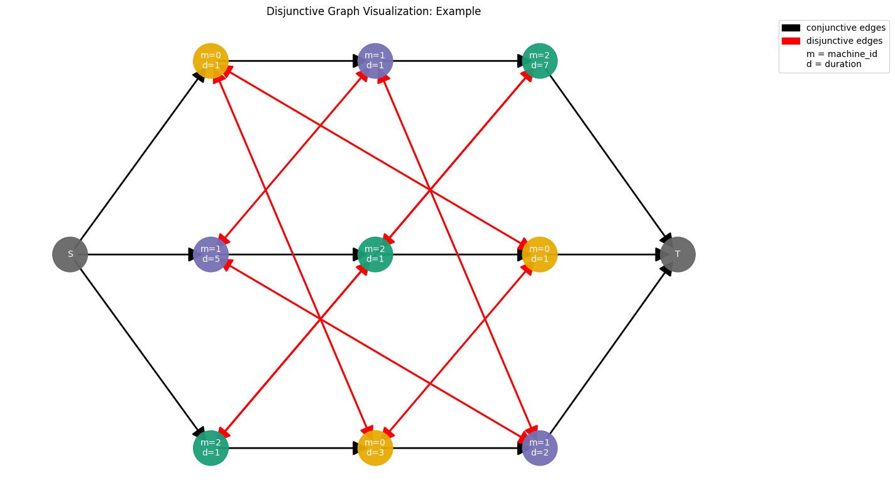

# job_shop_lib
[](https://github.com/Pabloo22/job_shop_lib/actions/workflows/tests.yaml)

[](https://github.com/psf/black)
[](https://opensource.org/licenses/MIT)


A Python library to model and solve the Job Shop Scheduling Problem with a special focus on graph representations.

## Example
```python
import matplotlib.pyplot as plt

from job_shop_lib import JobShopInstance, Operation
from job_shop_lib.solvers import CPSolver
from job_shop_lib.visualization import plot_gantt_chart


MACHINE_1 = 0
MACHINE_2 = 1
MACHINE_3 = 2

job_1 = [Operation(MACHINE_1, 1), Operation(MACHINE_2, 1), Operation(MACHINE_3, 7)]
job_2 = [Operation(MACHINE_2, 5), Operation(MACHINE_3, 1), Operation(MACHINE_1, 1)]
job_3 = [Operation(MACHINE_3, 1), Operation(MACHINE_1, 3), Operation(MACHINE_2, 2)]

jobs = [job_1, job_2, job_3]

instance = JobShopInstance(jobs, name="Example")

cp_sat_solver = CPSolver()
schedule = cp_sat_solver(instance)

fig, ax = plot_gantt_chart(schedule)
plt.show()
```


There is also a function to create gif animations from a Dispatching Rule Solver:

```python
from job_shop_lib.visualization import create_gif, get_plot_function
from job_shop_lib.benchmarks import load_benchmark_instance
from job_shop_lib.solvers import DispatchingRuleSolver, DispatchingRule

plt.style.use("ggplot")

solver = DispatchingRuleSolver(DispatchingRule.MOST_WORK_REMAINING)
plot_func = get_plot_function(title="Solution with Most Work Remaining Rule")
ft06 = load_benchmark_instance("ft06")
create_gif(
    gif_path="ft06_optimized.gif",
    instance=ft06,
    solver=DispatchingRuleSolver(),
    plot_function=plot_func,
    fps=4,
)
```


Furthermore, you can represent instances as graphs:

```python
from job_shop_lib.graphs import JobShopGraph
from job_shop_lib.visualization import plot_disjunctive_graph

disjunctive_graph = JobShopGraph.build_disjunctive_graph(instance)
plot_disjunctive_graph(disjunctive_graph)
plt.show()
```



For more details, check the [tutorial](tutorial) folder.

## Installation

In the future, the library will be available on PyPI. For now, you can install it from the source code.

1. Clone the repository.

2. Install [poetry](https://python-poetry.org/docs/) if you don't have it already:
```bash
pip install poetry==1.7
```
3. Create the virtual environment:
```bash
poetry shell
```
4. Install dependencies:
```bash
poetry install --with notebooks --with test --with lint
```
or equivalently:
```bash
make poetry_install_all 
```
