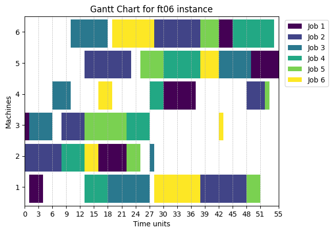
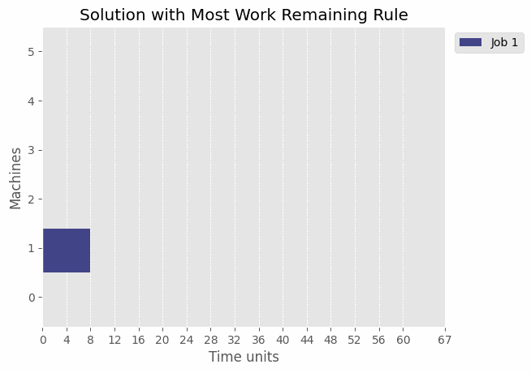
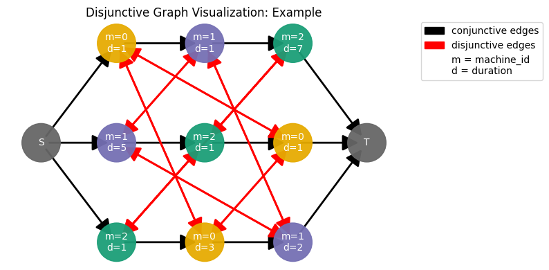
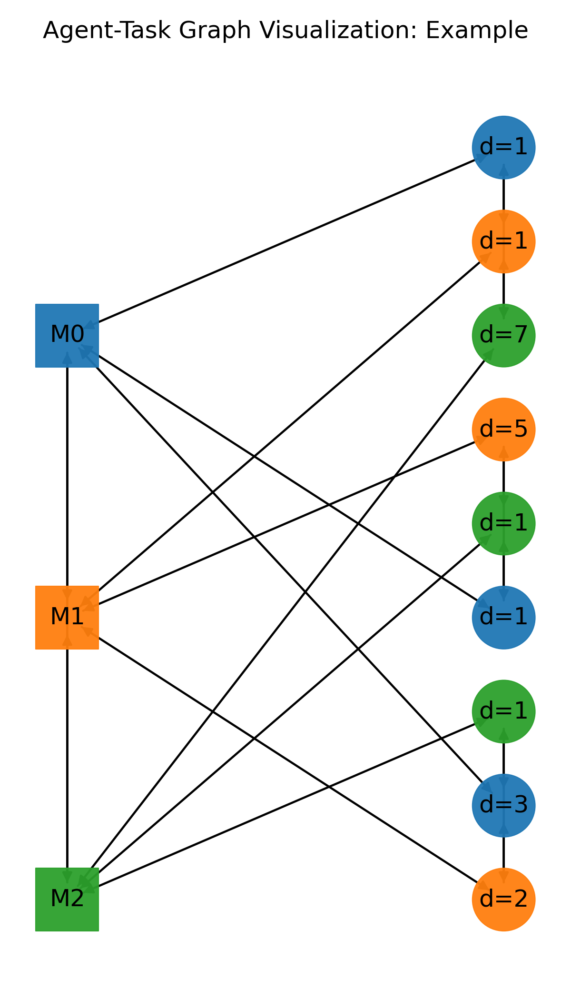

<div align="center">


<h1>JobShopLib</h1>

[](https://github.com/Pabloo22/job_shop_lib/actions/workflows/tests.yaml)
[](https://job-shop-lib.readthedocs.io/en/latest/?badge=latest)

[](https://github.com/psf/black)
[](https://opensource.org/licenses/MIT)

</div>

JobShopLib is a Python package for creating, solving, and visualizing job shop scheduling problems (JSSP).

It follows a modular design, allowing users to easily extend the library with new solvers, dispatching rules, visualization functions, etc.

See the [documentation](https://job-shop-lib.readthedocs.io/en/latest/) for more details about the latest version.

## Installation :package:

<!-- start installation -->

JobShopLib is distributed on [PyPI](https://pypi.org/project/job-shop-lib/) and it supports Python 3.10+.

You can install the latest stable version (version 0.5.1) using `pip`:

```bash
pip install job-shop-lib
```

See [this](https://colab.research.google.com/drive/1XV_Rvq1F2ns6DFG8uNj66q_rcowwTZ4H?usp=sharing) Google Colab notebook for a quick start guide! 


Version 1.0.0 is currently in beta stage and can be installed with:

```bash
pip install job-shop-lib==1.0.0b3
```

Although this version is not stable and may contain breaking changes in subsequent releases, it is recommended to install it to access the new reinforcement learning environments and familiarize yourself with new changes (see the [latest pull requests](https://github.com/Pabloo22/job_shop_lib/pulls?q=is%3Apr+is%3Aclosed)). There is a [documentation page](https://job-shop-lib.readthedocs.io/en/latest/) for versions 1.0.0a3 and onward.

<!-- end installation -->

<!-- key features -->

## Key Features :star:

- **Data Structures**: Easily create, manage, and manipulate job shop instances and solutions with user-friendly data structures. See [Getting Started](https://github.com/Pabloo22/job_shop_lib/blob/main/docs/source/tutorial/00-Getting-Started.ipynb) and [How Solutions are Represented](https://github.com/Pabloo22/job_shop_lib/blob/main/docs/source/tutorial/01-How-Solutions-are-Represented.ipynb).

- **Benchmark Instances**: Load well-known benchmark instances directly from the library without manual downloading. See [Load Benchmark Instances](https://github.com/Pabloo22/job_shop_lib/blob/main/docs/source/examples/05-Load-Benchmark-Instances.ipynb).

- **Random Instance Generation**: Create random instances with customizable sizes and properties or augment existing ones. See [`generation`](job_shop_lib/generation) package.

- **Multiple Solvers**:
  - **Constraint Programming Solver**: OR-Tools' CP-SAT solver. See [Solving the Problem](https://github.com/Pabloo22/job_shop_lib/blob/main/docs/source/tutorial/02-Solving-the-Problem.ipynb).

  - **Dispatching Rule Solvers**: Use any of the available dispatching rules or create custom ones. See [Dispatching Rules](https://github.com/Pabloo22/job_shop_lib/blob/main/docs/source/examples/03-Dispatching-Rules.ipynb).

- **Gantt Charts**: Visualize final schedules and how are they created iteratively by dispatching rule solvers or sequences of scheduling decisions with GIFs or videos. See [Save Gif](https://github.com/Pabloo22/job_shop_lib/blob/main/docs/source/examples/06-Save-Gif.ipynb).

- **Graph Representations**:
  - **Disjunctive Graphs**: Represent and visualize instances as disjunctive graphs. See [Disjunctive Graph](https://github.com/Pabloo22/job_shop_lib/blob/main/docs/source/examples/04-Disjunctive-Graph.ipynb).
  - **Agent-Task Graphs**: Encode instances as agent-task graphs (introduced in [ScheduleNet paper](https://arxiv.org/abs/2106.03051)). See [Agent-Task Graph](https://github.com/Pabloo22/job_shop_lib/blob/main/docs/source/examples/07-Agent-Task-Graph.ipynb).
  - Build your own custom graphs with the `JobShopGraph` class.

- **Gymnasium Environments**: Two environments for solving the problem with graph neural networks (GNNs) or any other method, and reinforcement learning (RL). See [SingleJobShopGraphEnv](https://github.com/Pabloo22/job_shop_lib/blob/main/docs/source/examples/09-SingleJobShopGraphEnv.ipynb) and [MultiJobShopGraphEnv](https://github.com/Pabloo22/job_shop_lib/blob/main/docs/source/examples/10-MultiJobShopGraphEnv.ipynb).

<!-- end key features -->

## Some Examples :rocket:

### Create a Job Shop Instance

You can create a `JobShopInstance` by defining the jobs and operations. An operation is defined by the machine(s) it is processed on and the duration (processing time).

```python
from job_shop_lib import JobShopInstance, Operation


job_1 = [Operation(machines=0, duration=1), Operation(1, 1), Operation(2, 7)]
job_2 = [Operation(1, 5), Operation(2, 1), Operation(0, 1)]
job_3 = [Operation(2, 1), Operation(0, 3), Operation(1, 2)]

jobs = [job_1, job_2, job_3]

instance = JobShopInstance(
    jobs,
    name="Example",
    # Any extra parameters are stored inside the
    # metadata attribute as a dictionary:
    lower_bound=7,
)
```

### Load a Benchmark Instance

You can load a benchmark instance from the library:

```python
from job_shop_lib.benchmarking import load_benchmark_instance

ft06 = load_benchmark_instance("ft06")
```

The module `benchmarking` contains functions to load the instances from the file and return them as `JobShopInstance` objects without having to download them
manually.

The contributions to this benchmark dataset are as follows:

- `abz5-9`: by Adams et al. (1988).

- `ft06`, `ft10`, `ft20`: by Fisher and Thompson (1963).

- `la01-40`: by Lawrence (1984)

- `orb01-10`: by Applegate and Cook (1991).

- `swb01-20`: by Storer et al. (1992).

- `yn1-4`: by Yamada and Nakano (1992).

- `ta01-80`: by Taillard (1993).

The metadata from these instances has been updated using data from:
https://github.com/thomasWeise/jsspInstancesAndResults

```python
>>> ft06.metadata
{'optimum': 55,
 'upper_bound': 55,
 'lower_bound': 55,
 'reference': "J.F. Muth, G.L. Thompson. 'Industrial scheduling.', Englewood Cliffs, NJ, Prentice-Hall, 1963."}
```

### Generate a Random Instance

You can also generate a random instance with the `GeneralInstanceGenerator` class.

```python
from job_shop_lib.generation import GeneralInstanceGenerator

generator = GeneralInstanceGenerator(
    duration_range=(5, 10), seed=42, num_jobs=5, num_machines=5
)
random_instance = generator.generate()
```

This class can also work as an iterator to generate multiple instances:

```python
generator = GeneralInstanceGenerator(iteration_limit=100, seed=42)
instances = []
for instance in generator:
    instances.append(instance)

# Or simply:
instances = list(generator)
```

### Solve an Instance with the OR-Tools' Constraint-Programming SAT Solver

Every solver is a `Callable` that receives a `JobShopInstance` and returns a `Schedule` object.

```python
import matplotlib.pyplot as plt

from job_shop_lib.constraint_programming import ORToolsSolver
from job_shop_lib.visualization import plot_gantt_chart

solver = ORToolsSolver(max_time_in_seconds=10)
ft06_schedule = solver(ft06)

fig, ax = plot_gantt_chart(ft06_schedule)
plt.show()
```


### Solve an Instance with a Dispatching Rule Solver

A dispatching rule is a heuristic guideline used to prioritize and sequence jobs on various machines. Supported dispatching rules are:

```python
class DispatchingRule(str, Enum):
    SHORTEST_PROCESSING_TIME = "shortest_processing_time"
    FIRST_COME_FIRST_SERVED = "first_come_first_served"
    MOST_WORK_REMAINING = "most_work_remaining"
    MOST_OPERATION_REMAINING = "most_operation_remaining"
    RANDOM = "random"
```

We can visualize the solution with a `DispatchingRuleSolver` as a gif:

```python
from job_shop_lib.visualization import create_gif, plot_gantt_chart_wrapper
from job_shop_lib.dispatching import DispatchingRuleSolver, DispatchingRule

plt.style.use("ggplot")

mwkr_solver = DispatchingRuleSolver("most_work_remaining")
plot_function = plot_gantt_chart_wrapper(
    title="Solution with Most Work Remaining Rule"
)
create_gif(
    gif_path="ft06_optimized.gif",
    instance=ft06,
    solver=mwkr_solver,
    plot_function=plot_function,
    fps=4,
)
```



The dashed red line represents the current time step, which is computed as the earliest time when the next operation can start.

> [!TIP]
> You can change the style of the gantt chart with `plt.style.use("name-of-the-style")`.
> Personally, I consider the `ggplot` style to be the cleanest.

### Representing Instances as Graphs

One of the main purposes of this library is to provide an easy way to encode instances as graphs. This can be very useful, not only for visualization purposes but also for developing graph neural network-based algorithms.

A graph is represented by the `JobShopGraph` class, which internally stores a `networkx.DiGraph` object.

####  Disjunctive Graph

The disjunctive graph is created by first adding nodes representing each operation in the jobs, along with two special nodes: a source $S$ and a sink $T$. Each operation node is linked to the next operation in its job sequence by **conjunctive edges**, forming a path from the source to the sink. These edges represent the order in which operations of a single job must be performed.

Additionally, the graph includes **disjunctive edges** between operations that use the same machine but belong to different jobs. These edges are bidirectional, indicating that either of the connected operations can be performed first. The disjunctive edges thus represent the scheduling choices available: the order in which operations sharing a machine can be processed. Solving the job shop scheduling problem involves choosing a direction for each disjunctive edge such that the overall processing time is minimized.

```python
from job_shop_lib.visualization import plot_disjunctive_graph

fig = plot_disjunctive_graph(instance)
plt.show()
```




> [!TIP]
> Installing the optional dependency [PyGraphViz](https://pygraphviz.github.io/) is recommended.

The `JobShopGraph` class provides easy access to the nodes, for example, to get all the nodes of a specific type:

```python
from job_shop_lib.graphs import build_disjunctive_graph

disjunctive_graph = build_disjunctive_graph(instance)

 >>> disjunctive_graph.nodes_by_type
 defaultdict(list,
            {<NodeType.OPERATION: 1>: [Node(node_type=OPERATION, value=O(m=0, d=1, j=0, p=0), id=0),
              Node(node_type=OPERATION, value=O(m=1, d=1, j=0, p=1), id=1),
              Node(node_type=OPERATION, value=O(m=2, d=7, j=0, p=2), id=2),
              Node(node_type=OPERATION, value=O(m=1, d=5, j=1, p=0), id=3),
              Node(node_type=OPERATION, value=O(m=2, d=1, j=1, p=1), id=4),
              Node(node_type=OPERATION, value=O(m=0, d=1, j=1, p=2), id=5),
              Node(node_type=OPERATION, value=O(m=2, d=1, j=2, p=0), id=6),
              Node(node_type=OPERATION, value=O(m=0, d=3, j=2, p=1), id=7),
              Node(node_type=OPERATION, value=O(m=1, d=2, j=2, p=2), id=8)],
             <NodeType.SOURCE: 5>: [Node(node_type=SOURCE, value=None, id=9)],
             <NodeType.SINK: 6>: [Node(node_type=SINK, value=None, id=10)]})
```

Other attributes include:
- `nodes`: A list of all nodes in the graph.
- `nodes_by_machine`: A nested list mapping each machine to its associated operation nodes, aiding in machine-specific analysis.
- `nodes_by_job`: Similar to `nodes_by_machine`, but maps jobs to their operation nodes, useful for job-specific traversal.

#### Resource-Task Graph

Introduced in the paper "ScheduleNet: Learn to solve multi-agent scheduling problems with reinforcement learning" by [Park et al. (2021)](https://arxiv.org/abs/2106.03051), the resource-task graph (orginally named "agent-task graph") is a graph that represents the scheduling problem as a multi-agent reinforcement learning problem.

In contrast to the disjunctive graph, instead of connecting operations
that share the same resources directly by disjunctive edges, operation
nodes are connected with machine ones.

All machine nodes are connected between them, and all operation nodes
from the same job are connected by non-directed edges too.

```python
from job_shop_lib.graphs import (
    build_complete_resource_task_graph,
    build_resource_task_graph_with_jobs,
    build_resource_task_graph,
)
from job_shop_lib.visualization import plot_resource_task_graph

complete_resource_task_graph = build_complete_resource_task_graph(instance)

fig = plot_resource_task_graph(complete_agent_task_graph)
plt.show()
```

<div align="center">

</div>
<br>

----

The library generalizes this graph by allowing the addition of job nodes and a global one (see `build_resource_task_graph_with_jobs` and `build_resource_task_graph`).

For more details, check the [examples](examples) folder.

## Installation for development

<!-- start installation development -->

1. Clone the repository.

```bash
git clone https://github.com/Pabloo22/job_shop_lib.git
cd job_shop_lib
```

2. Install [poetry](https://python-poetry.org/docs/) if you don't have it already:

```bash
pip install poetry
```

3. Install dependencies:
```bash
make poetry_install_all 
```

<!-- end installation development -->

## License :scroll:

This project is licensed under the MIT License - see the [LICENSE](LICENSE) file for details.


## References :books:

 - J. Adams, E. Balas, and D. Zawack, "The shifting bottleneck procedure
     for job shop scheduling," Management Science, vol. 34, no. 3,
     pp. 391–401, 1988.

 - J.F. Muth and G.L. Thompson, Industrial scheduling. Englewood Cliffs,
     NJ: Prentice-Hall, 1963.

 - S. Lawrence, "Resource constrained project scheduling: An experimental
     investigation of heuristic scheduling techniques (Supplement),"
     Carnegie-Mellon University, Graduate School of Industrial
     Administration, Pittsburgh, Pennsylvania, 1984.

 - D. Applegate and W. Cook, "A computational study of job-shop
     scheduling," ORSA Journal on Computer, vol. 3, no. 2, pp. 149–156,
     1991.

 - R.H. Storer, S.D. Wu, and R. Vaccari, "New search spaces for
     sequencing problems with applications to job-shop scheduling,"
     Management Science, vol. 38, no. 10, pp. 1495–1509, 1992.

 - T. Yamada and R. Nakano, "A genetic algorithm applicable to
     large-scale job-shop problems," in Proceedings of the Second
     International Workshop on Parallel Problem Solving from Nature
     (PPSN'2), Brussels, Belgium, pp. 281–290, 1992.

 - E. Taillard, "Benchmarks for basic scheduling problems," European
     Journal of Operational Research, vol. 64, no. 2, pp. 278–285, 1993.

- Park, Junyoung, Sanjar Bakhtiyar, and Jinkyoo Park. "ScheduleNet: Learn to solve multi-agent scheduling problems with reinforcement learning." arXiv preprint arXiv:2106.03051, 2021. 
